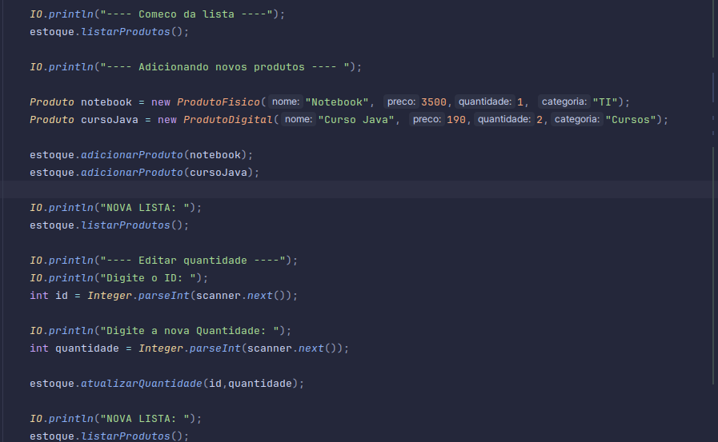
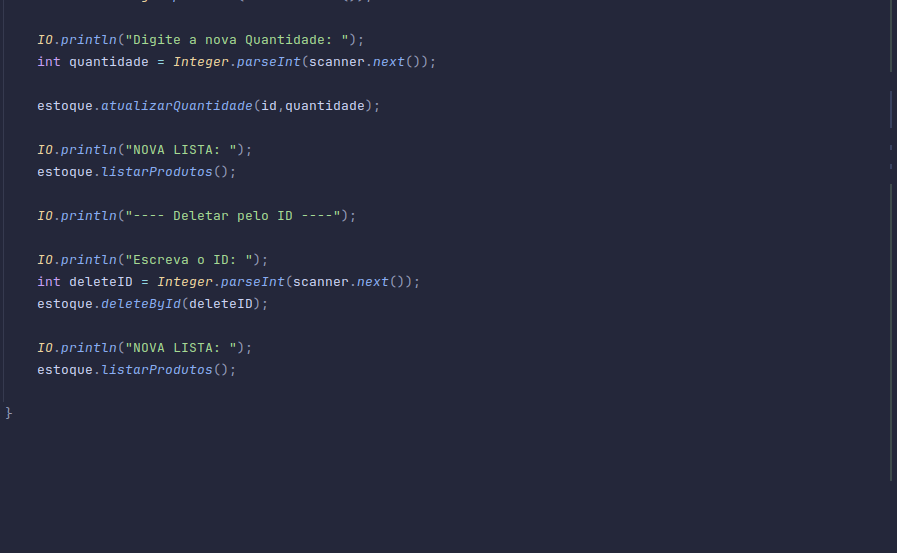
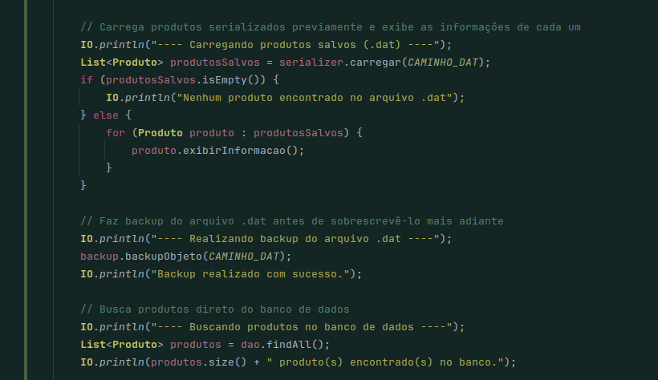
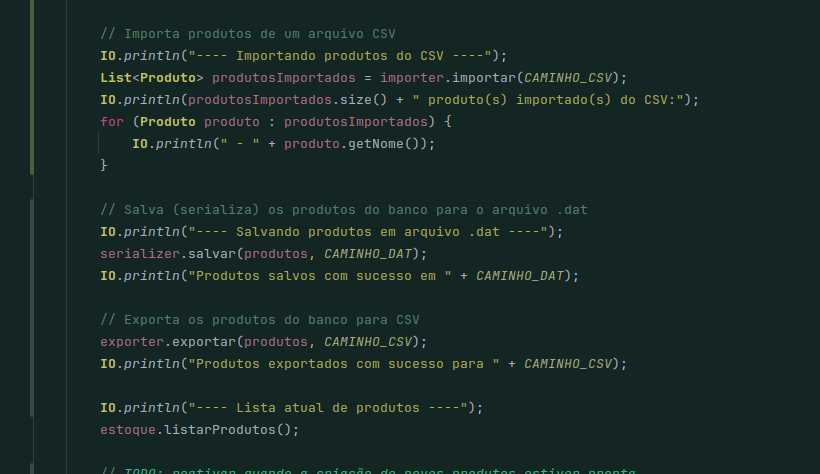
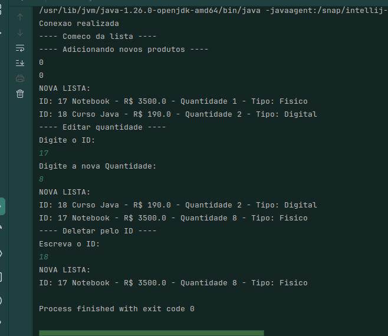

# 📦 StockFlow


Sistema de gerenciamento de estoque desenvolvido em **Java**, aplicando conceitos de **Programação Orientada a Objetos**, **JDBC**, **PostgreSQL** e **Java I/O**.

Este projeto faz parte da minha jornada de aprendizado para me tornar um **Desenvolvedor Back-End Java** e evolui continuamente conforme avanço no meu roadmap de estudos.

---

# 🚀 Funcionalidades

* ✅ Cadastro de produtos
* ✅ Listagem de produtos
* ✅ Busca por ID
* ✅ Atualização de produtos
* ✅ Remoção de produtos
* ✅ Controle de estoque
* ✅ Produtos físicos
* ✅ Produtos digitais
* ✅ Persistência em PostgreSQL
* ✅ Geração automática de IDs pelo banco
* ✅ Exportação de produtos para CSV
* ✅ Backup de dados utilizando serialização (`.dat`)
* ✅ Restauração de backups
* ✅ Arquitetura em camadas (Model • DAO • Service)
* ✅ Interface via terminal

---

# 🛠️ Tecnologias

* Java 21
* PostgreSQL
* JDBC
* Java I/O (NIO)
* Maven
* Git
* GitHub

---

# 📚 Conceitos Aplicados

## Programação Orientada a Objetos

* Classes e Objetos
* Encapsulamento
* Herança
* Polimorfismo
* Classes Abstratas
* Interfaces

## Collections Framework

* List
* ArrayList
* Iterator

## Tratamento de Exceções

* try/catch
* finally
* throw
* throws
* Exceções customizadas

## Banco de Dados

* PostgreSQL
* JDBC
* Connection
* PreparedStatement
* ResultSet
* Generated Keys
* CRUD completo

## Java I/O

* Path
* Files
* BufferedWriter
* BufferedReader
* InputStream
* OutputStream
* ObjectInputStream
* ObjectOutputStream
* Serializable
* Exportação CSV
* Backup e restauração de objetos

## Boas Práticas

* Separação de responsabilidades
* Arquitetura em camadas
* Reutilização de código
* Organização de pacotes
* Persistência desacoplada

---

# 📂 Estrutura do Projeto

```text
src
└── main
    └── java
        └── estoque
            ├── app
            ├── model
            ├── dao
            ├── service
            ├── database
            ├── io
            ├── exception
            └── Main.java
```

---

# 💾 Banco de Dados

O projeto utiliza **PostgreSQL** para persistência dos dados.

Tabela principal:

| Campo      | Tipo          |
| ---------- | ------------- |
| id         | SERIAL        |
| nome       | VARCHAR(100)  |
| preco      | DECIMAL(10,2) |
| quantidade | INTEGER       |
| categoria  | VARCHAR(50)   |
| tipo       | VARCHAR(20)   |

---

# ⚙️ Como executar

## Clone o projeto

```bash
git clone https://github.com/thiagofogaca25/StockFlow.git
```

```bash
cd StockFlow
```

## Crie o banco

```sql
CREATE DATABASE stockflow;
```

```sql
CREATE TABLE produtos (
    id SERIAL PRIMARY KEY,
    nome VARCHAR(100) NOT NULL,
    preco DECIMAL(10,2) NOT NULL,
    quantidade INT NOT NULL,
    categoria VARCHAR(50),
    tipo VARCHAR(20)
);
```

## Configure a conexão

Edite a classe `ConnectionFactory.java` com:

* URL
* Usuário
* Senha

## Execute

Pela IDE:

```
Main.java
```

Ou utilizando Maven:

```bash
mvn compile
mvn exec:java
```

---

# 📸 Imagens

### Estrutura do projeto



### Código





### Execução



---

# 📈 Roadmap do Projeto

## ✅ Concluído

* ✔️ Programação Orientada a Objetos
* ✔️ Collections Framework
* ✔️ Tratamento de Exceções
* ✔️ JDBC
* ✔️ PostgreSQL
* ✔️ Java I/O
* ✔️ CRUD completo
* ✔️ Exportação CSV
* ✔️ Backup e restauração de dados

## 🚧 Próximas implementações

* [ ] Spring Boot
* [ ] API REST
* [ ] Spring Data JPA
* [ ] Hibernate
* [ ] Bean Validation
* [ ] JUnit
* [ ] Mockito
* [ ] JWT
* [ ] Docker
* [ ] Swagger / OpenAPI

---

# 🎯 Objetivo

O **StockFlow** é meu projeto principal de estudos em Java.

A cada fase do roadmap, novas tecnologias e boas práticas são incorporadas ao sistema, transformando-o gradualmente em uma aplicação com arquitetura próxima à utilizada em projetos profissionais.

O próximo passo será migrar a aplicação para **Spring Boot**, mantendo a evolução contínua do projeto.

---

# 👨‍💻 Autor

**Thiago Fogaça**

GitHub
https://github.com/thiagofogaca25

LinkedIn
https://www.linkedin.com/in/thiago-fogaca

---

Se este projeto foi útil ou interessante para você, considere deixar uma ⭐ no repositório.
